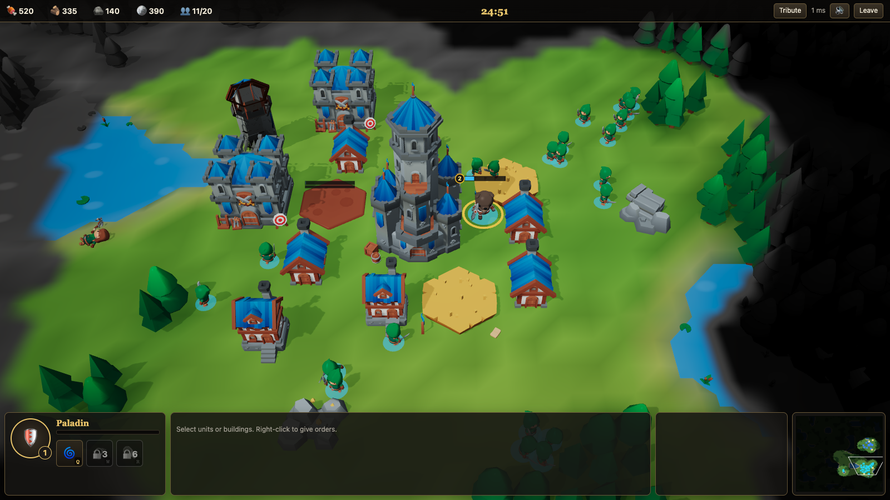

# Crownfall

A real-time strategy game for the browser: gather resources, build a base, train an army, level a hero and destroy the enemy team. Bots fill empty seats, so a match can be solo, mixed or all humans.



## Run it

```bash
docker compose up --build
```

Open http://localhost:8080 and press **Quick Play**.

## Develop

| What | Command |
|---|---|
| Server (port 5080) | `ASPNETCORE_URLS=http://localhost:5080 dotnet run --project src/Crownfall.Server --no-launch-profile` |
| Client (port 5173, proxies to the server) | `cd client && npm install && npm run dev` |
| Server tests | `dotnet test --project tests/<Project>` |
| Client tests and typecheck | `cd client && npm test && npm run typecheck` |
| Rebuild the characters, portraits, textures, sky, trees and sounds (needs Chrome and `unzip`) | `cd tools/assets && npm install && npm run build` |

## How it works

- **Server** (`src/`, .NET 10): runs every match as an authoritative 10 Hz simulation. Same seed and same commands replay the same match.
- **Protocol**: JSON messages plus compact binary snapshots, filtered per team by fog of war. Golden fixtures in `protocol/fixtures` keep the C# and TypeScript sides in step.
- **Client** (`client/`, TypeScript, React, Babylon.js): renders the world, interpolates between snapshots and sends commands.
- **Rendering**: procedural buildings and rocks in photo-scanned materials, Quaternius characters animated on the GPU from baked animation textures, sky lighting, camera-following shadows, tone mapping and a fog-of-war shader, all thin-instanced.
- **Content** (`content/game.json`): units, buildings, resources, races and hero abilities, shared by server and client.

## Credits

CC0 characters, textures, models and sounds from Quaternius, Poly Haven, ambientCG, KayKit, Kenney and OpenGameArt authors. See [CREDITS.md](CREDITS.md).
